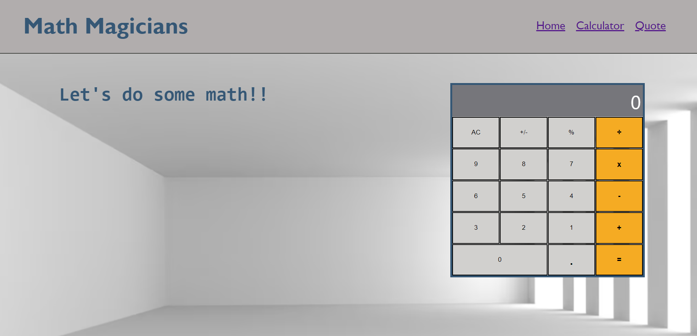

<a name="readme-top"></a>

<div align="center">

  
  <br/>

  <h3><b>Math Magicians</b></h3>
  <p>This is a WebApp that shows three pages: home, calculator and quote. Each one of the pages displays some information. Furthermore, the Calculator page displays a functional calculator that is free and easy to use by users.</p>

</div>

# 📗 Table of Contents

- [📗 Table of Contents](#-table-of-contents)
- [📖 \[PokeApp\] ](#-pokeapp-)
  - [🛠 Built With ](#-built-with-)
    - [Tech Stack ](#tech-stack-)
    - [Key Features ](#key-features-)
  - [🚀 Live Demo ](#-live-demo-)
  - [💻 Getting Started ](#-getting-started-)
    - [Prerequisites](#prerequisites)
    - [Setup](#setup)
    - [Install](#install)
    - [Build](#build)
    - [Run](#run)
    - [Deployment](#deployment)
  - [👥 Authors ](#-authors-)
  - [🔭 Future Features ](#-future-features-)
  - [🤝 Contributing ](#-contributing-)
  - [© Acknowledge ](#-acknowledge-)
  - [⭐ Show your support ](#-show-your-support-)
  - [❓ FAQ ](#-faq-)
  - [📝 License ](#-license-)

# 📖 [Math Magicians] <a name="about-project"></a>

*[Math Magicians]* a WebApp that shows three pages: home, calculator and quote. Each one of the pages displays some information. Furthermore, the Calculator page displays a functional calculator that is free and easy to use by users..
<div align="center">

  

  <br/>

</div>

## 🛠 Built With <a name="built-with"></a>

### Tech Stack <a name="tech-stack"></a>

  <ul>
    <li><a href="https://developer.mozilla.org/en-US/docs/Web/HTML" target="_blank" rel="noopener noreferrer">HTML</a></li>
    <li><a href="https://developer.mozilla.org/en-US/docs/Web/CSS" target="_blank" rel="noopener noreferrer">CSS</a></li>
    <li><a href="https://developer.mozilla.org/en-US/docs/Web/JavaScript" target="_blank" rel="noopener noreferrer">Javascript</a></li>
    <li><a href="https://webpack.js.org/" target="_blank" rel="noopener noreferrer">WebPack</a></li>
    <li><a href="https://es.reactjs.org/" target="_blank" rel="noopener noreferrer">React</a></li>
  </ul>


### Key Features <a name="key-features"></a>


- *Dinamically displays the pages that were build by using react function based components.*


<p align="right">(<a href="#readme-top">back to top</a>)</p>


## 🚀 Live Demo <a name="live-demo"></a>

- <a href="" target="_blank" rel="noopener noreferrer">Math magicians - Live Demo</a>


<p align="right">(<a href="#readme-top">back to top</a>)</p>


## 💻 Getting Started <a name="getting-started"></a>

To get a local copy up and running, follow these steps.

### Prerequisites

In order to run this project you need `git` locally installed. Please got to [Getting Started - Installing Git guide](https://git-scm.com/book/en/v2/Getting-Started-Installing-Git) and follow the steps described for your system to install `git`.

### Setup

Clone this repository to your desired folder:
```sh
  cd my-folder
  git clone git@github.com:luigirazum/mv-pokeapp.git
```

### Install

Install this project with:
```sh
  cd math magicians
  npm install
```

### Build

To build the project, execute the following command:
```sh
  npm run build  
```

### Run

To run tests, run the following command:
sh
  npm start


### Deployment

You can deploy this project using:
```sh
  npm deploy
```

<p align="right">(<a href="#readme-top">back to top</a>)</p>


## 👥 Authors <a name="authors"></a>

👨‍💻 Juan Pablo Guerrero

- GitHub: <a href="https://github.com/juanpa8830" target="_blank" rel="noopener noreferrer">@Juanpa8830</a>

<p align="right">(<a href="#readme-top">back to top</a>)</p>


## 🔭 Future Features <a name="future-features"></a>

- [ ] *Add some popular quotes.*

<p align="right">(<a href="#readme-top">back to top</a>)</p>


## 🤝 Contributing <a name="contributing"></a>

In order to improve this project, contributions, issues, and feature requests are welcome!

Feel free to check the [issues page](../../issues/).


<p align="right">(<a href="#readme-top">back to top</a>)</p>


## © Acknowledge <a name="acknowledge"></a>


<p align="right">(<a href="#readme-top">back to top</a>)</p>


## ⭐ Show your support <a name="support"></a>

I really enjoyed doing this project, so, if you like it, I´d appreciate your support giving me a ⭐.


<p align="right">(<a href="#readme-top">back to top</a>)</p>


## ❓ FAQ <a name="faq"></a>

<p align="right">(<a href="#readme-top">back to top</a>)</p>


## 📝 License <a name="license"></a>

This project is [MIT](./LICENSE) licensed.

<p align="right">(<a href="#readme-top">back to top</a>)</p>
